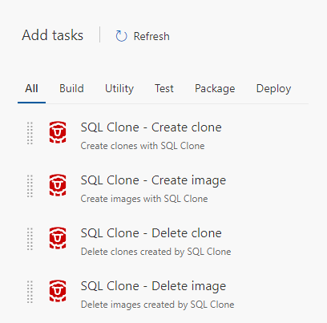

# Redgate SQL Clone

Easily integrate database provisioning tasks into Visual Studio Team Services or Team Foundation Server with Redgate [SQL Clone](http://www.red-gate.com/products/dba/sql-clone/).

Installing this extension provides three tasks:
* **Create image** – An image is a full sized copy of a database at a point in time and can be created from a live database or backup file.
* **Create clone** – Clones reference the data stored in the image so can be created in seconds using MBs of disk space.  
* **Delete clone** – Remove any clones that are no longer in use.
* **Delete image** – Remove any image that are no longer in use.

## Getting started with SQL Clone

SQL Clone allows full copies of a database to be provisioned in seconds, using only a few MB of disk space. You will need a SQL Clone Server installed to make use of this extension. Download your 14 day free trial [here](http://www.red-gate.com/products/dba/sql-clone/).

### Creating a SQL Clone Service Endpoint

To perform any build or release tasks with the SQL Clone extension, a "SQL Clone Server" connected service must be configured in the administration section for your project. When in the Services section, you can select SQL Clone Server from the New Service Endpoint drop down.

Give the connection a name, and add the URL for your SQL Clone Server. If you have limited permissions to your SQL Clone Server to a specific user group, you can also add a username and password which will be used when connecting.

The SQL Clone Server URL must be accessible by any build agents running SQL Clone tasks.

### Create image

All database clones are created from an initial image. Use this task to create an image from a live database or backup file. 

The image location is where this image will be created and stored. Image locations must have already been added directly to the SQL Clone Server.

Build and Release variables can be specified in the image name to make them unique, for example $(build.buildid). 

### Create clone

A clone is a fully functional database which can be created in seconds and using only a few MBs of local disk space.

Specify the image the clone will be created from, as well as the target SQL Server instance and clone name. The SQL Server instance must have been added directly to the SQL Clone Server.

### Delete clone

Remove clones created specifically for this build process.

### Delete image

Remove image created specifically for this build process.

## Tools and Pricing

Installing this extension is free, but requires a SQL Clone Server to be installed and accessible from any build agents running clone tasks. You can download a 14 day free trial of SQL Clone [here](http://www.red-gate.com/products/dba/sql-clone/).

[SQL Clone](http://www.red-gate.com/products/dba/sql-clone/) is a database provisioning tool , which is licensed per user and can be purchased by contacting Redgate [sales](mailto:sales@redgate.com).
